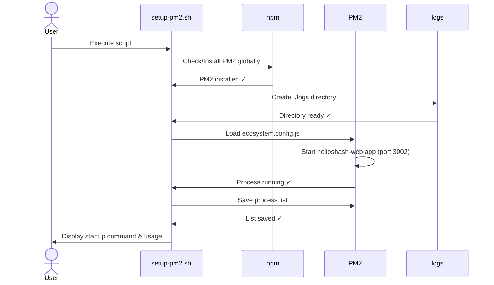

# Contributing to HeliosHash DAO

Thanks for wanting to contribute! This document covers quick local setup, PM2 development workflow, testing, and how to run the CI locally.

## Table of Contents

- Local development
- PM2 (dev server) usage
- Running tests (unit & E2E)
- Git workflow and PRs

## Local development

### Clone & install

Run the following to clone and install repository dependencies:

```bash
git clone https://github.com/nutraz/HeliosHash-DAO.git
cd HeliosHash-DAO
pnpm install
```

### Optional: Start the DFX local network

If you're working with canisters, start the local replica and deploy:

```bash
dfx start --background --clean
dfx deploy
```

### Start the web dev server

During development we run the Next.js dev server from `apps/web` on port 3002.

```bash
cd apps/web
pnpm dev -p 3002
```

Open the app at [http://localhost:3002](http://localhost:3002)

## PM2 (dev server) usage

To run the dev server detached (helps running E2E tests and keeping the server alive across sessions) we provide a PM2 ecosystem config and helper script.

- Start with PM2 using the provided ecosystem file:

```bash
cd apps/web
pm2 start ecosystem.config.cjs --only helioshash-web
```

- Setup PM2 to start at boot (one-time, requires sudo):

```bash
cd $(git rev-parse --show-toplevel)
./scripts/setup-pm2.sh
# the script will print a final 'pm2 startup' command — run it with sudo if required
```

- Useful PM2 commands

```bash
pm2 status
pm2 logs helioshash-web --lines 200
pm2 restart helioshash-web --update-env
pm2 stop helioshash-web
pm2 delete helioshash-web
pm2 save
```

Note: We use `NEXT_PUBLIC_FORCE_HEAVY_SPLASH=true` in the ecosystem config to enable the animated splash during development.

### PM2 setup sequence

The following sequence diagram shows how `scripts/setup-pm2.sh` automates installation, starting the PM2 process, and persisting it across restarts:



## Running tests (unit & E2E)

Unit tests (Vitest)

```bash
cd apps/web
pnpm test:run
```

End-to-end tests (Playwright)

We run Playwright E2E against the dev server running on port 3002. Recommended flow:

```bash
# Start dev server in background with PM2 (or foreground in separate terminal)
cd apps/web
pm2 start ecosystem.config.cjs --only helioshash-web

# Wait until the server is healthy (curl http://localhost:3002)
pnpm test:e2e
```

If you need to re-run tests with a fresh process list, use `pm2 save` to persist or `pm2 delete helioshash-web` and re-start.

## Git workflow and PRs

- Branch from `main` using `feature/*` or `fix/*` naming.
- Open a Pull Request against `main` and include a short description of changes and a checklist of items (build status, tests passing, manual steps).

Thanks for contributing — please follow the code style and test suite conventions and open issues/PRs for larger changes.
