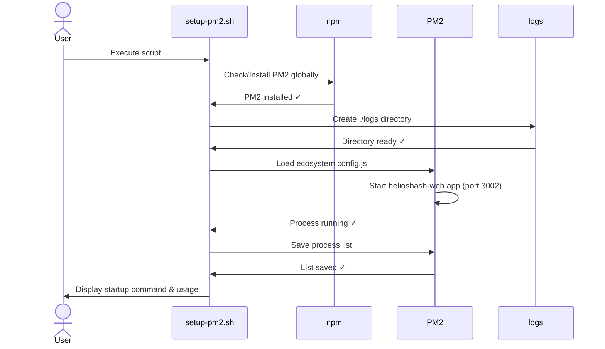

# PM2 setup sequence

This diagram visualizes the automated steps performed by `scripts/setup-pm2.sh` when preparing the PM2-managed dev server for `helioshash-web`.

\
Notes:

- The script will also print the `pm2 startup` command that must be run with `sudo` to register PM2 startup on system boot.

- Logs are stored under `apps/web/logs` by default (see `ecosystem.config.cjs`).
