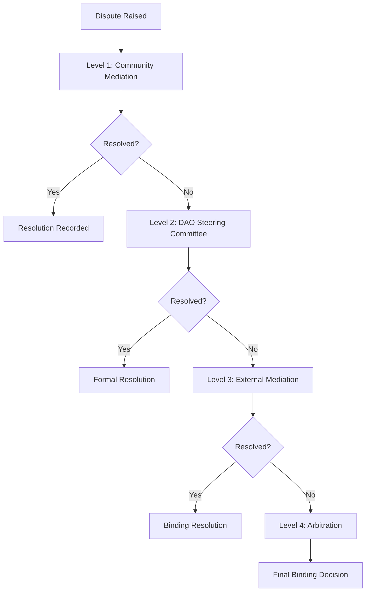

# 🏛️ HeliosHash DAO Dispute Resolution Framework

**Document Version:** 1.0  
**Effective Date:** October 5, 2025  
**Integration:** HeliosHash DAO Governance Framework  
**Canister:** `hhdao_dispute_resolution`

---

## 🎯 Purpose & Scope

This document formalizes the dispute escalation process for HeliosHash DAO, implementing a clear, pre-defined arbitration mechanism for unresolved disputes as identified in our governance enhancement analysis.

The framework provides a structured path from internal community resolution to external arbitration, ensuring fair and transparent conflict resolution while maintaining community autonomy.

---

## 🔄 Dispute Escalation Process Overview



---

## 🏛️ Four-Level Dispute Resolution Structure

### Level 1: Community Mediation (0-14 days)

**Scope:** Interpersonal conflicts, minor operational disagreements, resource allocation disputes under ₹50,000

**Process:**

- Dispute raised through community forum or WhatsApp group
- Community volunteer mediators facilitate discussion
- Informal resolution through community consensus
- 7-day discussion period + 7-day cooling-off period

**Authority:** Community consensus (>50% agreement)
**Cost:** Free
**Binding:** Morally binding, enforced through social consensus

### Level 2: DAO Steering Committee Arbitration (7-21 days)

**Scope:** Governance disputes, constitutional interpretation, resource allocation ₹50,000-₹5,00,000

**Process:**

- Formal dispute submission to Steering Committee
- 7-day evidence submission period
- Steering Committee deliberation (3-of-5 decision required)
- Formal written decision with reasoning

**Authority:** DAO Steering Committee (3-of-5 multi-sig)
**Cost:** ₹5,000 dispute processing fee
**Binding:** Constitutionally binding, enforced through smart contracts

### Level 3: External Mediation (14-45 days)

**Scope:** Technical disputes, complex financial matters, resource allocation >₹5,00,000

**Process:**

- Selection of neutral third-party mediator
- Professional mediation session(s)
- Attempt at mutually agreeable resolution
- Non-binding recommendation if no agreement

**Authority:** Professional mediator (advisory only)
**Cost:** ₹25,000-₹75,000 (split between parties)
**Binding:** Only if both parties agree to binding mediation

### Level 4: External Arbitration (30-90 days)

**Scope:** Constitutional violations, breach of fiduciary duty, disputes >₹10,00,000

**Process:**

- Formal arbitration through recognized arbitration body
- Legal proceedings with evidence submission
- Professional arbitrator decision
- Enforceable through Indian legal system

**Authority:** Professional arbitrator/arbitration panel
**Cost:** ₹1,00,000-₹5,00,000+ (as per arbitration rules)
**Binding:** Legally binding and enforceable

---

## 🎯 Dispute Categories & Automatic Routing

### Category A: Governance Disputes → Level 2 Start

- Constitutional interpretation disagreements
- Voting threshold disputes
- Leadership election challenges
- Revenue allocation disagreements

### Category B: Operational Disputes → Level 1 Start

- Day-to-day operational conflicts
- Community resource access
- Work assignment disagreements
- Communication conflicts

### Category C: Financial Disputes → Level Based on Amount

- Under ₹50,000 → Level 1
- ₹50,000 - ₹5,00,000 → Level 2
- Over ₹5,00,000 → Level 3

### Category D: Technical Disputes → Level 3 Start

- Canister functionality disagreements
- Technical architecture decisions
- Security protocol disputes
- Performance optimization conflicts

### Category E: Constitutional Violations → Level 4 Direct

- Breach of constitutional principles
- Fiduciary duty violations
- Fraud or misappropriation allegations
- Systematic governance failures

---

## 🛠️ Implementation in Smart Contracts

The dispute resolution process is codified in the `hhdao_dispute_resolution` canister with the following key functions:

### Dispute Submission

```motoko
public shared ({ caller }) func submitDispute(
    title: Text,
    description: Text,
    category: DisputeCategory,
    involvedParties: [Principal],
    requestedResolution: Text,
    evidence: [Text] // IPFS hashes or document references
) : async Result.Result<Nat, Text>
```

### Automatic Level Assignment

```motoko
public func determineDisputeLevel(
    category: DisputeCategory,
    financialAmount: ?Nat,
    isConstitutional: Bool
) : DisputeLevel
```

### Timeline Enforcement

```motoko
public func checkDisputeTimeouts() : async [Nat] // Returns expired dispute IDs
```

### Resolution Recording

```motoko
public shared ({ caller }) func recordResolution(
    disputeId: Nat,
    resolution: Text,
    resolutionType: ResolutionType,
    bindingLevel: BindingLevel
) : async Result.Result<(), Text>
```

---

## ⚖️ Arbitration Partner Integration

### Primary Arbitration Partners

**1. India International Centre for Alternative Dispute Resolution (IICADR)**

- **Specialization**: Commercial and governance disputes
- **Cost Structure**: ₹50,000 base + percentage of disputed amount
- **Timeline**: 60-90 days average
- **Binding Authority**: Enforceable under Indian Arbitration Act

**2. Indian Council of Arbitration (ICA)**

- **Specialization**: Commercial disputes, cooperative governance
- **Cost Structure**: Sliding scale based on dispute value
- **Timeline**: 45-75 days average
- **Binding Authority**: Full legal enforceability

**3. Blockchain & Crypto Arbitration Network (BCAN)**

- **Specialization**: Cryptocurrency and blockchain disputes
- **Cost Structure**: 2-5% of disputed amount in crypto
- **Timeline**: 30-60 days (all online)
- **Binding Authority**: International recognition

### Integration Process

1. **Automatic Selection**: Based on dispute category and amount
2. **Multi-Option Provision**: Parties can choose from approved arbitrators
3. **Cost Escrow**: Smart contract holds arbitration fees
4. **Decision Integration**: Arbitration decisions automatically update DAO records
5. **Enforcement**: Binding decisions trigger smart contract execution

---

## 🔧 Dispute Prevention Mechanisms

### Proactive Measures

**1. Clear Documentation**

- Comprehensive role definitions in governance framework
- Detailed operational procedures
- Transparent decision-making processes

**2. Regular Communication**

- Weekly operational meetings
- Monthly community assemblies
- Quarterly governance reviews

**3. Early Warning Systems**

- Automated alerts for potential conflicts
- Performance monitoring and feedback
- Regular stakeholder satisfaction surveys

**4. Training & Education**

- Conflict resolution skills training for leaders
- Community education on governance processes
- Regular workshops on cooperative principles

### Conflict De-escalation Tools

**1. Cooling-off Periods**

- Mandatory 48-hour pause for heated discussions
- Structured reflection and consultation time
- Mediated communication facilitation

**2. Neutral Facilitation**

- Trained community mediators
- External facilitation for sensitive topics
- Anonymous feedback mechanisms

**3. Restorative Justice Principles**

- Focus on relationship repair
- Community healing processes
- Collaborative solution finding

---

## 📊 Performance Metrics & Continuous Improvement

### Dispute Resolution KPIs

| Metric                      | Target       | Measurement      |
| --------------------------- | ------------ | ---------------- |
| **Level 1 Resolution Rate** | >80%         | Monthly          |
| **Average Resolution Time** | <30 days     | Per dispute      |
| **Community Satisfaction**  | >4.0/5.0     | Quarterly survey |
| **Escalation Rate**         | <15%         | Monthly          |
| **Cost per Resolution**     | <₹10,000 avg | Quarterly        |
| **Repeat Disputes**         | <10%         | Annually         |

### Continuous Improvement Process

**Monthly Reviews**

- Dispute pattern analysis
- Process effectiveness assessment
- Community feedback integration

**Quarterly Assessments**

- Arbitrator performance evaluation
- Cost-benefit analysis of different levels
- Process optimization recommendations

**Annual Framework Review**

- Complete dispute resolution framework assessment
- Stakeholder satisfaction comprehensive survey
- Integration with constitutional and governance updates

---

## 🔒 Confidentiality & Privacy Protection

### Information Handling

**Public Information**

- Dispute existence and category
- Resolution timeline and status
- Final resolution summary (anonymized)

**Confidential Information**

- Personal details of involved parties
- Detailed evidence and testimony
- Mediation discussions and negotiations
- Individual voting records in resolution

**Restricted Information**

- Financial details beyond dispute amount
- Private communications not directly relevant
- Sensitive community information
- Personal circumstances and vulnerabilities

### Data Protection Measures

1. **Encryption**: All dispute records encrypted at rest and in transit
2. **Access Control**: Role-based access to dispute information
3. **Anonymization**: Public reporting uses anonymized data
4. **Retention Policy**: Dispute records maintained for 7 years, then archived
5. **Right to Privacy**: Parties can request additional privacy protections

---

## 📋 Standard Operating Procedures

### For Community Members

**Raising a Dispute**

1. Attempt direct resolution first
2. Document the issue clearly
3. Submit through official channels
4. Provide relevant evidence
5. Engage constructively in resolution process

**Participating in Resolution**

1. Respond to communications promptly
2. Provide evidence and testimony honestly
3. Respect confidentiality requirements
4. Accept binding decisions
5. Support implementation of resolutions

### For Mediators/Arbitrators

**Preparation Phase**

1. Review dispute documentation thoroughly
2. Identify key issues and stakeholders
3. Plan resolution process timeline
4. Ensure neutrality and absence of conflicts
5. Prepare necessary resources and tools

**Resolution Phase**

1. Facilitate fair and balanced discussions
2. Maintain neutrality and objectivity
3. Document process and decisions clearly
4. Ensure confidentiality requirements
5. Follow up on resolution implementation

### For DAO Leadership

**Oversight Responsibilities**

1. Monitor dispute resolution effectiveness
2. Ensure process compliance and fairness
3. Provide resources and support as needed
4. Review and improve processes regularly
5. Report to community on dispute resolution performance

---

## 🌟 Integration with Existing Systems

### Governance Framework Integration

- Disputes automatically logged in governance reporting
- Resolution decisions integrated with constitutional compliance tracking
- Performance metrics included in quarterly governance reviews

### Treasury Integration

- Automatic escrow of dispute-related funds
- Cost allocation and payment processing
- Financial impact tracking and reporting

### Communication System Integration

- Automatic notifications through existing channels
- Integration with community forums and WhatsApp groups
- Reporting through governance dashboards

### 1WP Ecosystem Integration

- Alignment with 1WP dispute resolution best practices
- Sharing of lessons learned with other 1WP nodes
- Access to 1WP mediation and arbitration resources

---

## 🚀 Implementation Timeline

### Phase 1: Foundation (Month 1)

- [ ] **Deploy Dispute Resolution Canister**: Technical implementation
- [ ] **Partner Integration**: Establish relationships with arbitration bodies
- [ ] **Community Training**: Educate community on dispute resolution process
- [ ] **Documentation**: Create user guides and process documentation

### Phase 2: Testing & Refinement (Month 2)

- [ ] **Pilot Testing**: Run simulated disputes through the system
- [ ] **Process Refinement**: Adjust procedures based on testing
- [ ] **Mediator Training**: Train community volunteers in mediation
- [ ] **Integration Testing**: Ensure proper integration with governance systems

### Phase 3: Full Deployment (Month 3)

- [ ] **System Activation**: Go live with full dispute resolution system
- [ ] **Community Launch**: Announce availability and procedures
- [ ] **Monitoring**: Begin performance tracking and metrics collection
- [ ] **Continuous Improvement**: Implement feedback loops for ongoing optimization

---

## 📚 Related Documents

- [DAO Governance Framework](./DAO_GOVERNANCE_FRAMEWORK.md)
- [HeliosHash DAO Constitution](./HeliosHash-DAO/memory/constitution.md)
- [Compliance Analysis Report](./COMPLIANCE_ANALYSIS_REPORT.md)

---

_This dispute resolution framework ensures fair, transparent, and efficient conflict resolution while maintaining community autonomy and constitutional compliance. It provides clear escalation paths from community mediation to binding arbitration, supporting the cooperative principles and governance objectives of HeliosHash DAO._
